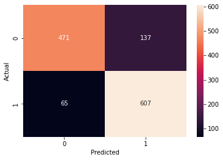
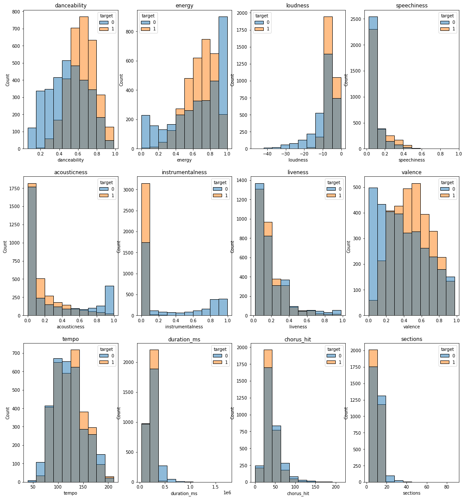
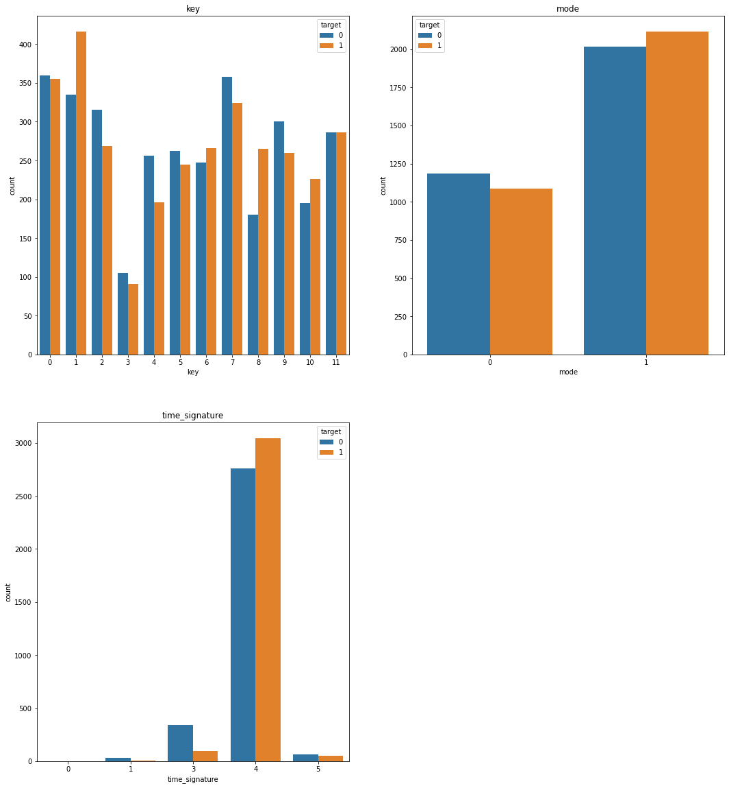

# Spotify Hit Predictor

## Business Value: 
Let's do a quick calculation: 40,000 songs a day are equivalent to 280,000 songs a week or about 1.2 million songs a month for a total of 14.6 million tracks in a year!

Therefore, at the current rate, every three and a half years, Spotify will add over 50 million songs to its catalog.

However, only 100 songs make it to Billboard Hot 100 list each week. This chart is updated every Tuesday morning.

This means that only approximately 0.036% songs make it to the list each week.

The purpose of this hit predictor is to give musicians insights about the music they create and if it has chances of appearing on the Billboard Hot 100 list.
Musicians can input data about various features of their song and observe the prediction made by hitting the 'Hit or Miss' button.

The model is developed using a decision-tree-based ensemble Machine Learning algorithm called the XGBClassifier(XGBoost classifier).

This model was tuned using RandomSearchCV

While guessing a "Hit" song, the model observed the following scores: 
- Overall Model Accuracy : 84%
- Precision : 82%
- Recall: 90%

## Confusion Matrix

## Context: 
This is a dataset consisting of features for tracks fetched using Spotify's Web API. The tracks are labeled '1' or '0' ('Hit' or 'Flop') depending on some criteria of the author.
This dataset can be used to make a classification model that predicts whether a track would be a 'Hit' or not.

(Note: The author does not objectively considers a track inferior, bad or a failure if its labeled 'Flop'. 'Flop' here merely implies that it is a track that probably could not be considered popular in the mainstream.)

## Acknowledgement:
	
- "spotipy": Python module for Spotify's API (https://pypi.org/project/spotipy/)

- "billboard": Python module for Billboard's API (https://pypi.org/project/billboard.py/)

- Spotify, the company itself. For keeping a database of such in-depth details of every track in their library. And for exposing their API for the world to use.
  
 - Kaggle Dataset (https://www.kaggle.com/theoverman/the-spotify-hit-predictor-dataset)

## Content:

Features of the dataset can be reviewed here: https://developer.spotify.com/documentation/web-api/reference/#/operations/get-audio-features

- track: The Name of the track.

- artist: The Name of the Artist.

- uri: The resource identifier for the track.

- danceability: Danceability describes how suitable a track is for dancing based on a combination of musical elements including tempo, rhythm stability, beat strength, and overall regularity. A value of 0.0 is least danceable and 1.0 is most danceable. 

- energy: Energy is a measure from 0.0 to 1.0 and represents a perceptual measure of intensity and activity. Typically, energetic tracks feel fast, loud, and noisy. For example, death metal has high energy, while a Bach prelude scores low on the scale. Perceptual features contributing to this attribute include dynamic range, perceived loudness, timbre, onset rate, and general entropy. 

- key: The estimated overall key of the track. Integers map to pitches using standard Pitch Class notation. E.g. 0 = C, 1 = C?/D?, 2 = D, and so on. If no key was detected, the value is -1.

- loudness: The overall loudness of a track in decibels (dB). Loudness values are averaged across the entire track and are useful for comparing relative loudness of tracks. Loudness is the quality of a sound that is the primary psychological correlate of physical strength (amplitude). Values typical range between -60 and 0 db. 

- mode: Mode indicates the modality (major or minor) of a track, the type of scale from which its melodic content is derived. Major is represented by 1 and minor is 0.

- speechiness: Speechiness detects the presence of spoken words in a track. The more exclusively speech-like the recording (e.g. talk show, audio book, poetry), the closer to 1.0 the attribute value. Values above 0.66 describe tracks that are probably made entirely of spoken words. Values between 0.33 and 0.66 describe tracks that may contain both music and speech, either in sections or layered, including such cases as rap music. Values below 0.33 most likely represent music and other non-speech-like tracks. 

- acousticness: A confidence measure from 0.0 to 1.0 of whether the track is acoustic. 1.0 represents high confidence the track is acoustic. The distribution of values for this feature look like this:

- instrumentalness: Predicts whether a track contains no vocals. “Ooh” and “aah” sounds are treated as instrumental in this context. Rap or spoken word tracks are clearly “vocal”. The closer the instrumentalness value is to 1.0, the greater likelihood the track contains no vocal content. Values above 0.5 are intended to represent instrumental tracks, but confidence is higher as the value approaches 1.0. The distribution of values for this feature look like this:

- liveness: Detects the presence of an audience in the recording. Higher liveness values represent an increased probability that the track was performed live. A value above 0.8 provides strong likelihood that the track is live.

- valence: A measure from 0.0 to 1.0 describing the musical positiveness conveyed by a track. Tracks with high valence sound more positive (e.g. happy, cheerful, euphoric), while tracks with low valence sound more negative (e.g. sad, depressed, angry).

- tempo: The overall estimated tempo of a track in beats per minute (BPM). In musical terminology, tempo is the speed or pace of a given piece and derives directly from the average beat duration. 

- duration_ms:  The duration of the track in milliseconds.

- time_signature: An estimated overall time signature of a track. The time signature (meter) is a notational convention to specify how many beats are in each bar (or measure).

- chorus_hit: This the the author's best estimate of when the chorus would start for the track. Its the timestamp of the start of the third section of the track. This feature was extracted from the data received by the API call for Audio Analysis of that particular track.

- sections: The number of sections the particular track has. This feature was extracted from the data received by the API call for Audio Analysis of that particular track.

- target: The target variable for the track. It can be either '0' or '1'. '1' implies that this song has featured in the weekly list (Issued by Billboards) of Hot-100 tracks in that decade at least once and is therefore a 'hit'. '0' Implies that the track is a 'flop'.

The author's condition of a track being 'flop' is as follows:

        - The track must not appear in the 'hit' list of that month or year.
        - The track's artist must not appear in the 'hit' list of that decade.
        - The track must belong to a genre that could be considered non-mainstream and / or avant-garde. 
        - The track must have 'US' as one of its markets.

## Visualizations of Numeric(Continuous) Features

## Visualizations of Categorical Features

